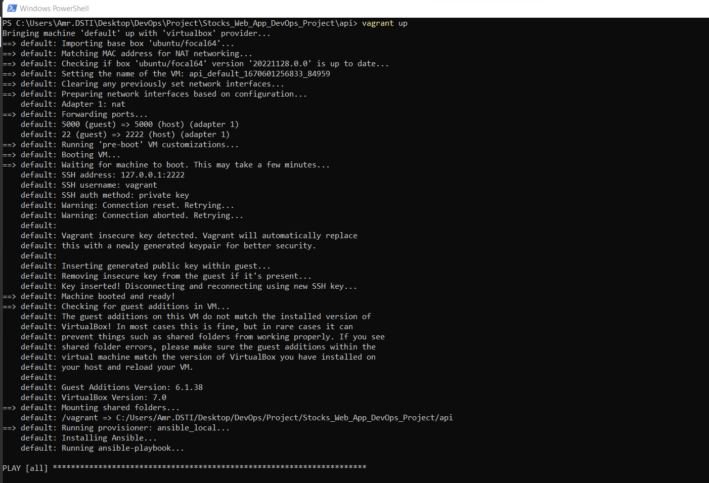
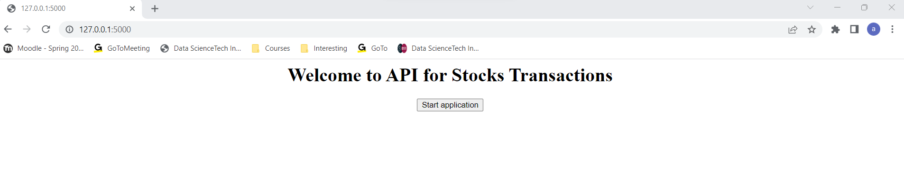
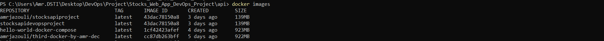
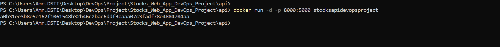
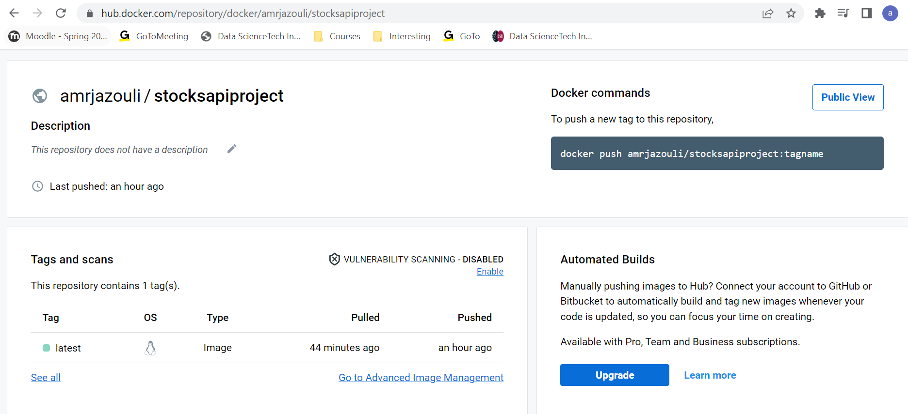
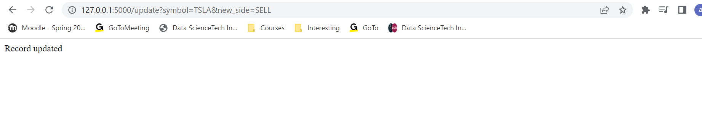
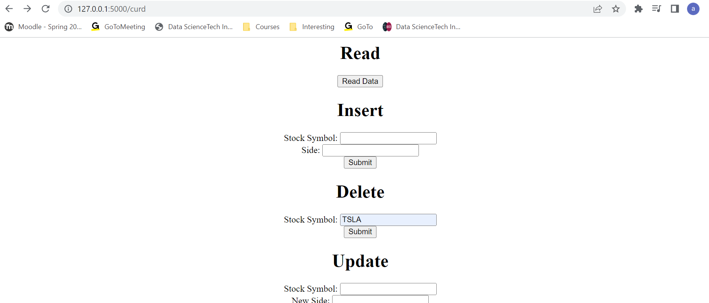

# Stocks Transactions API Web Application

## Bonuses

To get bonuses, I have chosen to create a Flask web application in Python and use a different database than Redis, such as MongoDB. I also performed functional tests.

For Kubernetes task, I used minikube cluster and configured kubectl.

## 1. Flask Web API for Stocks Transactions

It's a Flask web application according to REST API that applies CRUD operations on a stock transaction to handle its basic details in MongoDB database.

### Functionalities

1. Create a stock transation
2. Update the transaction from BUY to SELL or vice-versa
3. Get transactions to read them
4. Delete any stock transaction that has been previoulsy created

### Installation Instructions

This application is written on Python and it uses MongoDB database.
After cloning this repository, go to the api folder:

```
cd api 
```

1. Create a virtual environment with the following command (Replace <envname> with the name you choose to give your virtual environment ):
```
conda create -n <envname> 
``` 
2. Activate your virtual environment:
```
conda activate <envname> 
```
3. Install all the packages needed for the application to run using 'pip' and the requirement.txt file:
```
pip install -r requirements.txt 
```
4. Install MongoDB on localhost or set up a MongoDB Atlas account in the cloud.


### Usage and Instructions

1. Run the application. From api folder, (where `app.py` file is located) run:

```
flask run
```

It will start a web server available in your browser at http://localhost:5000.


2. The first page displays a welcome message, then click on 'Start application'.
Create a stock transaction:

In Insert section, type e.g. 'TSLA' in Stock Symbol and 'BUY' in Side, then click on 'Submit'.


A message of successful insert will be displayed:


Check your MongoDB Database if the record has been inserted correctly:


You can check the same with UPDATE, READ and DELETE operations.

Press CTRL+C to stop the web server.

### Testing

Because of some import errors, I didn't move the test_functionalities.py file into a test folder.

Run the following command:

```
python -m pytest -v -s
```
A test session in the CLI will start and display results of passed and failed tests:


  
  
## 2. Deployment to Azure with application code:  

In this case, the startup app is not in the root directory, therefore, we tried to add a startup command such as **'gunicorn --bind=0.0.0.0 --timeout 600 --chdir api application:app'**, but, the required librairies will not be installed in the virtual environment at the deployment because **'requirements.txt'** is not in the root directory.

According to documentation, in this case, the **'requirements.txt'** should be moved to the root directory, which might not be convenient for some reasons (ReasonsToBeDeveloped).

To deploy the web app by keeping the **'requirements.txt'** in the subfolder, we have to update the existing workflow provided at the deployment of the Azure web app.
The modification will consist in adding the keyword and its value **'package: ./api'** in the deployment job at :

**'deploy->steps->name: 'Deploy to Azure Web App'->with->package: ./api'**

Having simultanesouly the startup command mentioned above and the keyword-value **'package: ./api'** in the deloyment job will result in this error: **'Error: can't chdir to 'api'**
    
  

## 3. Configuring, provisioning a virtual environment and running the application using the IaC approach:

I created a Vagrantfile and configured it so that the VM would run on a ubuntu/focal64.
I also provisioned the VM with ansible_local, the provisionning consists in installing pip3, the app file and the requirements.
Last but not least, a task to run the flask app is specified as well.
I only copied the requirements.txt and app.py files, as Vagrant by default will share the project directory in order to get the other files (such as HTML templates folder) to /vagrant in the VM.
[https://developer.hashicorp.com/vagrant/docs/synced-folders] 

Before running the VM, I disabled the Windows Hyper-V ( as Administrator) with the following command:

```
Disable-WindowsOptionalFeature -Online -FeatureName Microsoft-Hyper-V-All
```

Then, I ran the VM as following:

```
vagrant up
```







## 4. Docker image of the application:

To build the Docker image of the application, I typed the following command:

```
docker build -t stocksapidevopsproject .
```
A message showing the building has finished will be displayed in the CLI:


To list the Docker images, type the following:

```
docker images
```

I am able to see the recent docker image I have just created :



The docker image should be available in Docker Desktop as well.

I have run the Docker image I created as following:

```
docker run -d -p 8000:5000 stocksapidevopsproject
```


The web server should start on http://localhost:8000 as shown following:


Press CTRL+C to stop the web server.

I tagged the Docker image as following:

```
docker tag stocksapidevopsproject amrjazouli/stocksapiproject
```

where 'amrjazouli' - is my account on Docker Hub, stocksapiproject - the custom name of the image.

After logging in to DockeHub in CLI, I pushed the Docker image to my Docker Hub account:

```
docker push amrjazouli/stocksapiproject
```

The Docker image should be available on Docker Hub:



## 5. Container orchestration using Docker Compose:

Using the 'docker-compose.yml' file, from the project root directory, I typed the following command:

```
.\STOCKS_WEB_APP_DEVOPS_PROJECT>docker-compose up
```

The web server and MongoDB containers will start, I can check the CLI and the web browser on 
http://localhost:8000:


I tried to insert a transaction to check if it is inserted correctly in the MongoDB instance:


A successful message is displayed as following:


I tried to update and delete to check the other CURD operations:







## 6. Docker orchestration using Kubernetes:

Below is screenshot of installation and set up of Minikube and kubectl:


Then, I deployed the application and exposed the service with the following commands as shown below:


```
kubectl apply -f deployment.yml
```

```
kubectl apply -f service.yml
```

The web server is running on              :


To check the deployment and pods on the Kubernetes dashboard, I typed the following:

```
minikube dashboard
```


