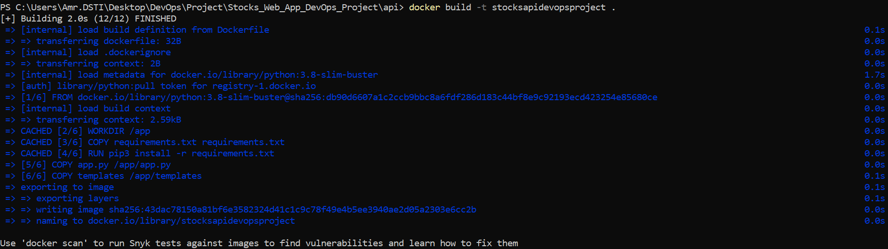

## 1. Docker image of the application:

To build the Docker image of the application, I typed the following command:

```
docker build -t stocksapidevopsproject .
```
A message showing the building has finished will be displayed in the CLI:



To list the Docker images, type the following:

```
docker images
```

I am able to see the recent docker image I have just created :


The docker image should be available in Docker Desktop as well.

I have run the Docker image I created as following:

```
docker run -d -p 8000:5000 stocksapidevopsproject
```


The web server should start on http://localhost:8000 as shown following:


Press CTRL+C to stop the web server.

I tagged the Docker image as following:

```
docker tag stocksapidevopsproject amrjazouli/stocksapiproject
```

where 'amrjazouli' - is my account on Docker Hub, stocksapiproject - the custom name of the image.

After logging in to DockeHub in CLI, I pushed the Docker image to my Docker Hub account:

```
docker push amrjazouli/stocksapiproject
```

The Docker image should be available on Docker Hub:


## 2. Container orchestration using Docker Compose:

Using the 'docker-compose.yml' file, from the project root directory, I typed the following command:

```
docker-compose up
```

The web server and MongoDB containers will start, I can check the CLI and the web browser on 
http://localhost:8000:


I tried to insert a transaction to check if it is inserted correctly in the MongoDB instance:


A successful message is displayed as following:


We query the database and check simultaneously if insertion, update and delete operations are performed successfully while we interact with the api through the browser webpage.


I tried to update and delete to check the other CURD operations:


