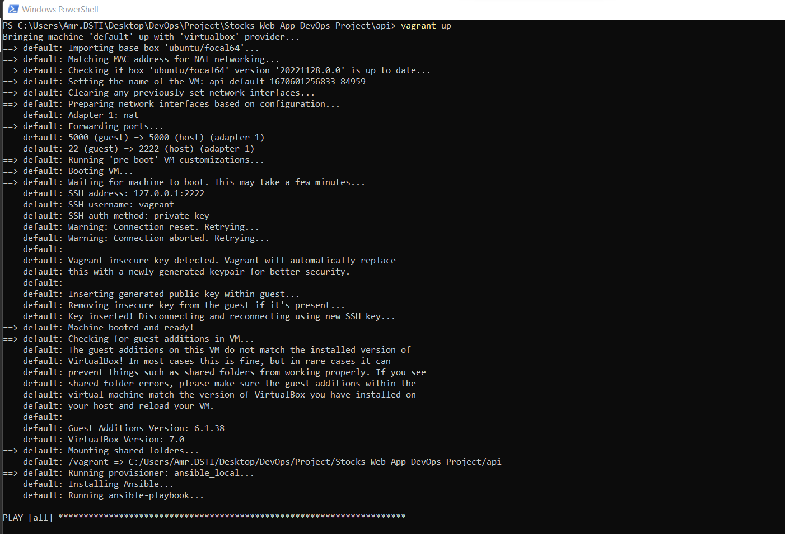
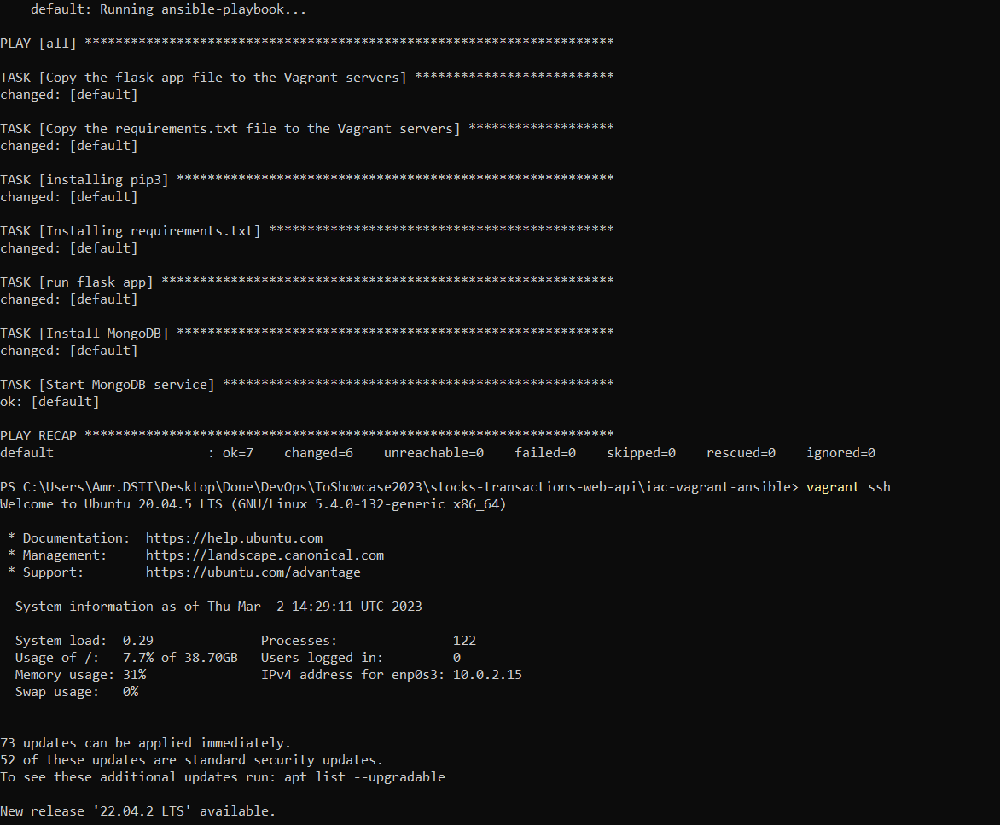
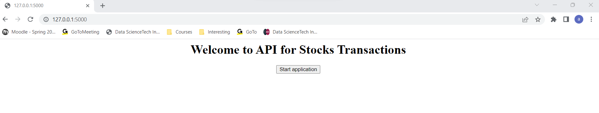
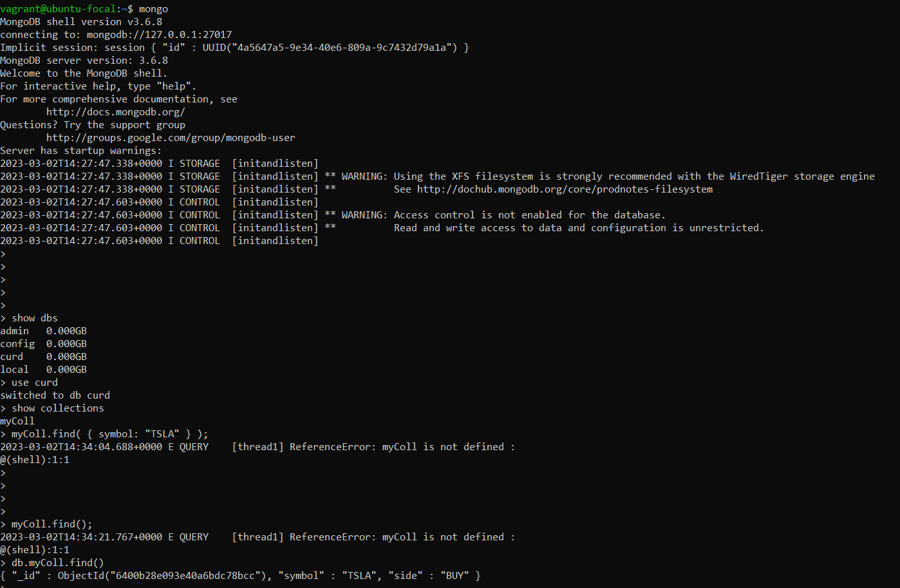
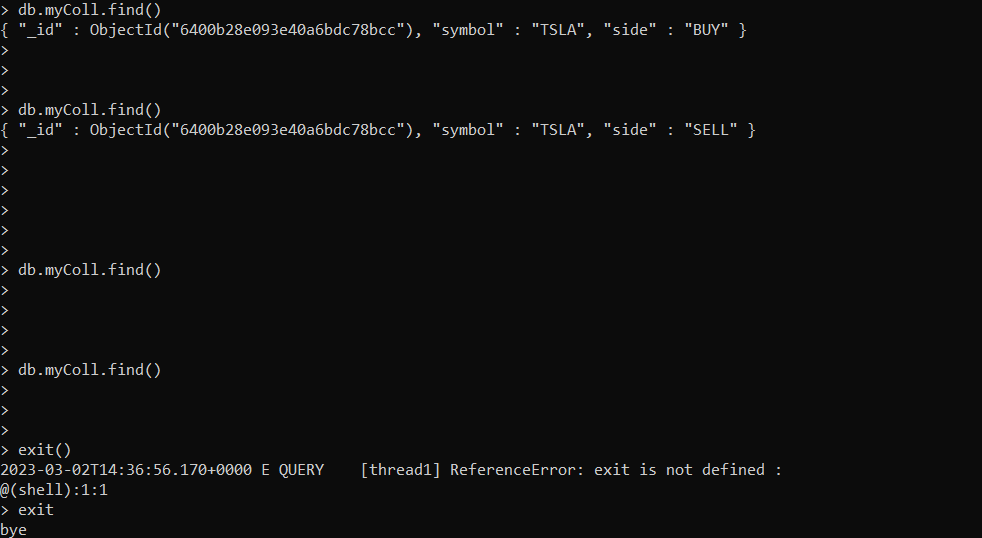

## Configuring, provisioning a virtual environment and running the application using the IaC approach:

I created a Vagrantfile and configured it so that the VM would run on a ubuntu/focal64.
I also provisioned the VM with ansible_local, the provisionning consists in installing pip3, the app file and the requirements.
Last but not least, a task to run the flask app is specified as well.
I only copied the requirements.txt and app.py files, as Vagrant by default will share the project directory in order to get the other files (such as HTML templates folder) to /vagrant in the VM.
[https://developer.hashicorp.com/vagrant/docs/synced-folders] 

Before running the VM, I disabled the Windows Hyper-V ( as Administrator) with the following command:

```
Disable-WindowsOptionalFeature -Online -FeatureName Microsoft-Hyper-V-All
```

Then, I ran the VM as following:

```
vagrant up
```







We make some operations on the api through the browser webpage, and we query the database simultaneously to check if operations have been successfully performed.



