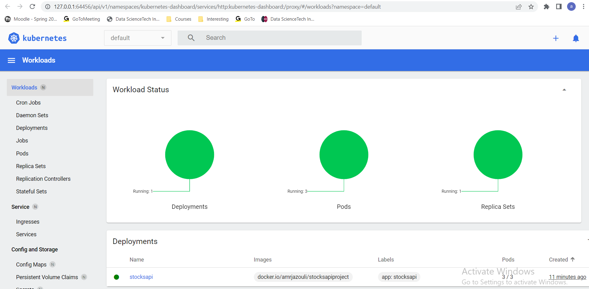
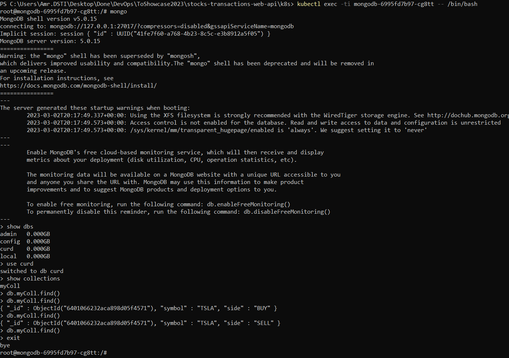

## Docker orchestration using Kubernetes:

For Kubernetes, I used minikube cluster to run kubernetes locally and configured kubectl.

Below is screenshot of installation and set up of Minikube and kubectl:


Then, I deployed the application and exposed the service with the following commands as shown below:


```
kubectl apply -f deployment.yml
```

```
kubectl apply -f service.yml
```

The web server is running on :


To check the deployment and pods on the Kubernetes dashboard, I typed the following:

```
minikube dashboard
```




Then, we connect to the pod of mongodb, to query the database and check simultaneously if insertion, update and delete operations are performed successfully while we interact with the api through the browser webpage.

